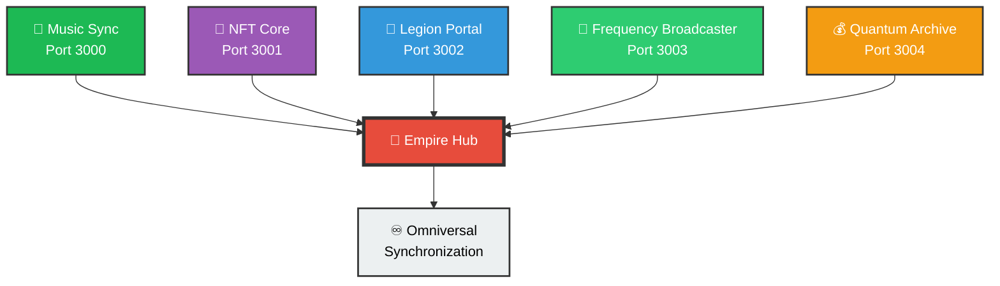

<div align="center">

# 🎵 ScrollSoul Music Sync Platform 🌌

### Omniversal Music Licensing & Distribution API with Empire-Wide Integration

[](https://github.com/chaishillomnitech1/scrollsoul-music-sync)
[](LICENSE)
[](https://nodejs.org)
[](API.md)
[](#)
[](#)
[](#)
[](.github/workflows)
[](Dockerfile)
[](k8s/)

[](https://expressjs.com/)
[](https://nodejs.org/)
[](#)
[](#)

**[🚀 Quick Start](#-quick-start)** • 
**[📡 API Docs](API.md)** • 
**[🔗 Integration](INTEGRATION.md)** • 
**[🚢 Deploy](DEPLOYMENT.md)** • 
**[🌟 Empire](MASTER-SHOWCASE.md)** •
**[✨ New Features](NEW_FEATURES.md)**

---

</div>

## 🎉 What's New in v1.3.0

🚀 **Major Update!** ScrollSoul Music Sync now includes:

- ✅ **YouTube, TikTok & Spotify Integrations** - Upload once, distribute everywhere
- ✅ **GitHub Actions CI/CD** - Automated testing, building, and deployment
- ✅ **Docker & Kubernetes Support** - Production-ready containerization
- ✅ **Interactive GitHub Pages Showcase** - Beautiful documentation site
- ✅ **Marketing Materials** - Blog templates, press kit, social media content
- ✅ **65+ Passing Tests** - Comprehensive test coverage

**[📖 Read the Full Release Notes →](NEW_FEATURES.md)**

---

## 🌟 Overview

The **ScrollSoul Music Sync Platform** is a comprehensive music metadata and licensing API system that tracks placements, licenses, and royalties for music featured in **film, TV, sports, and advertising campaigns.** 

This system ensures your sovereign sound frequencies align with global markets and omniversal resonance while seamlessly integrating with the entire **ScrollSoul Empire ecosystem**.

---

## ✨ Core Features

<table>
<tr>
<td width="50%">

### 🎼 Music Management
- **Complete Catalog System** with 963Hz/999Hz frequency tracking
- **ISRC/ISWC Metadata** management
- **Publisher & Composer** tracking
- **Genre & BPM** classification
- **Full CRUD Operations** via REST API

</td>
<td width="50%">

### 📜 Licensing System
- **Synchronization Licenses** for film/TV
- **Master Use Agreements** for advertising
- **Territory Management** (Worldwide/Regional)
- **Rights Tracking** (broadcast, streaming, digital)
- **Fee & Duration** management

</td>
</tr>
<tr>
<td width="50%">

### 🎬 Placement Tracking
- **Film, TV & Advertising** placements
- **Production Company** tracking
- **Status Management** (confirmed/pending)
- **Air Date Scheduling** 
- **Platform Filtering** capabilities

</td>
<td width="50%">

### 💰 Royalty Management
- **Automated Calculations** by period/source
- **Artist/Publisher Splits** 
- **Payment Status** tracking
- **Revenue Analytics** with summaries
- **Multi-source Aggregation**

</td>
</tr>
</table>

---

## 🔗 Empire Integration (NEW!)

<div align="center">

### Connected to the Full ScrollSoul Sovereign Empire

[](#empire-integration-new)
[](#empire-integration-new)
[](#empire-integration-new)
[](#empire-integration-new)

### New Platform Integrations (v1.3.0+)

[](#)
[](#)
[](#)
[](#)

</div>

### 🌌 Multi-System Integration Features

- **🎨 NFT Verification** - Authenticate users via scrollsoul-nft-core (Thoth Sigil holders)
- **🫡 Legion Certification** - Verify Star Seed leadership via legion-certification-portal
- **📡 Frequency Sync** - Synchronize 963Hz/999Hz broadcasts with galactic-frequency-broadcaster
- **💰 QFS Integration** - Automated wealth distribution via quantum-eternal-archive
- **🔒 Cross-System Auth** - Unified authentication across all empire platforms
- **📊 Empire Analytics** - Aggregated metrics across all 5 systems

**[📖 Read Full Integration Guide →](INTEGRATION.md)**

---

## 🛡️ Security & Authentication (NEW!)

<div align="center">

[](#)
[](#)
[](#)
[](#)

</div>

### 🔐 Advanced Security Features

- **🔑 API Key Authentication** - Secure access control with X-API-Key headers
- **🎨 NFT-Based Auth** - Wallet address verification for NFT holders
- **🫡 Legion Certification** - Token-based authentication for certified members
- **⏱️ Rate Limiting** - 100 requests/minute per IP with smart throttling
- **🛡️ Security Headers** - XSS protection, clickjacking prevention, CSP
- **📝 Request Validation** - Input sanitization and schema validation
- **📊 Request Logging** - Complete audit trail of all API calls
- **🚫 Zero Vulnerabilities** - Clean security scan results

---

## 🏢 Enterprise Solutions (NEW v1.3.0+)

<div align="center">

[](#)
[](#)
[](#)
[](#)

</div>

### 💼 Enterprise Tiers

<table>
<tr>
<td width="25%">

**STARTER**
- Standard API access
- Basic analytics
- Community support
- Shared infrastructure

</td>
<td width="25%">

**PROFESSIONAL**
- ✅ Custom branding
- ✅ Advanced analytics
- ✅ Priority support
- ✅ Audit logs

</td>
<td width="25%">

**ENTERPRISE**
- ✅ Private endpoints
- ✅ 99.9% SLA
- ✅ Multi-region
- ✅ SSO integration

</td>
<td width="25%">

**ENTERPRISE PLUS**
- ✅ Dedicated infra
- ✅ 99.99% SLA
- ✅ 1-hour support
- ✅ Custom features

</td>
</tr>
</table>

### 🎨 Enterprise Features

- **Custom Branding** - White-label solution with your company's branding
- **Private Endpoints** - Dedicated API endpoints with IP whitelisting
- **Multi-Region Deployment** - Deploy across multiple geographic regions
- **Advanced SLA** - Up to 99.99% uptime guarantee
- **Priority Support** - 24/7 support with 1-hour response time
- **Custom Integrations** - Tailor-made integrations for your workflow

**[📖 Read Enterprise Deployment Guide →](ENTERPRISE_DEPLOYMENT.md)**

---

## 🚀 Quick Start

### Prerequisites


### Installation

```bash
# Clone the repository
git clone https://github.com/chaishillomnitech1/scrollsoul-music-sync.git
cd scrollsoul-music-sync

# Install dependencies
npm install
```

### Configuration

```bash
# Copy environment template
cp .env.example .env

# Edit configuration (use your favorite editor)
nano .env  # or vim, code, etc.
```

#### Required Environment Variables

```bash
# Server Configuration
PORT=3000
NODE_ENV=development

# Distribution Partner API Keys
VYDIA_API_KEY=your_vydia_api_key_here
SPOTIFY_CLIENT_ID=your_spotify_client_id_here
SPOTIFY_CLIENT_SECRET=your_spotify_client_secret_here
NIKE_CAMPAIGN_API_KEY=your_nike_campaign_api_key_here

# Security Configuration (NEW!)
API_KEY=your_secure_api_key
REQUIRE_API_KEY=false          # Set to true for production
REQUIRE_NFT_AUTH=false         # Enable NFT-based authentication
REQUIRE_LEGION_AUTH=false      # Enable Legion certification

# Empire Integration Endpoints (NEW!)
NFT_CORE_ENDPOINT=http://localhost:3001
LEGION_PORTAL_ENDPOINT=http://localhost:3002
FREQUENCY_BROADCASTER_ENDPOINT=http://localhost:3003
QUANTUM_ARCHIVE_ENDPOINT=http://localhost:3004
```

### Running the Server

```bash
# Start in production mode
npm start

# Start in development mode
npm run dev

# Run tests
npm test
```

### Quick Test

```bash
# Test the API is running
curl http://localhost:3000/

# Check health status
curl http://localhost:3000/health

# View integration status (NEW!)
curl http://localhost:3000/api/integration/status
```

---

## 📡 Complete API Reference

### 🎵 Music Catalog Endpoints

| Method | Endpoint | Description |
|--------|----------|-------------|
| `GET` | `/api/music` | Get all music tracks |
| `GET` | `/api/music/:id` | Get track by ID |
| `POST` | `/api/music` | Add new track |
| `PUT` | `/api/music/:id` | Update track |
| `DELETE` | `/api/music/:id` | Delete track |

<details>
<summary><b>📝 Example: Get Music Catalog</b></summary>

```bash
curl http://localhost:3000/api/music
```

```json
{
  "success": true,
  "count": 2,
  "data": [
    {
      "id": 1,
      "title": "ScrollSoul Awakening",
      "artist": "ScrollSoul Sovereign",
      "frequency": "963Hz",
      "duration": 240,
      "genre": "Sovereign Resonance",
      "bpm": 111,
      "key": "C Major",
      "metadata": {
        "isrc": "SCROLLSOUL001",
        "publisher": "ScrollSoul Empire Publishing"
      }
    }
  ]
}
```
</details>

### 📜 Licensing Endpoints
### 📜 Licensing Endpoints

| Method | Endpoint | Description |
|--------|----------|-------------|
| `GET` | `/api/licensing` | Get all licenses |
| `GET` | `/api/licensing/:id` | Get license by ID |
| `GET` | `/api/licensing/track/:trackId` | Get licenses for track |
| `POST` | `/api/licensing` | Create new license |
| `PUT` | `/api/licensing/:id` | Update license |

### 🎬 Placement Endpoints

| Method | Endpoint | Description |
|--------|----------|-------------|
| `GET` | `/api/placements` | Get all placements |
| `GET` | `/api/placements/:id` | Get placement by ID |
| `POST` | `/api/placements` | Create placement |
| `PUT` | `/api/placements/:id` | Update placement |

**Query Filters:** `?platform=Film&status=confirmed`

### 💰 Royalty Endpoints

| Method | Endpoint | Description |
|--------|----------|-------------|
| `GET` | `/api/royalties` | Get all royalties |
| `GET` | `/api/royalties/:id` | Get royalty by ID |
| `GET` | `/api/royalties/summary/totals` | Get summary ⭐ |
| `POST` | `/api/royalties` | Create royalty record |
| `PUT` | `/api/royalties/:id` | Update royalty |

**Query Filters:** `?period=2026-Q1&status=paid`

### 📦 Distribution Endpoints

| Method | Endpoint | Description |
|--------|----------|-------------|
| `GET` | `/api/distribution/partners` | Get all partners |
| `GET` | `/api/distribution/partners/:id` | Get partner by ID |
| `GET` | `/api/distribution` | Get distributions |
| `POST` | `/api/distribution` | Create distribution |
| `POST` | `/api/distribution/sync/:partnerId` | Sync partner ⭐ |

### 📊 Analytics Endpoints

| Method | Endpoint | Description |
|--------|----------|-------------|
| `GET` | `/api/analytics/dashboard` | Overall dashboard ⭐ |
| `GET` | `/api/analytics/campaigns` | Campaign analytics |
| `GET` | `/api/analytics/placements` | Placement analytics |
| `GET` | `/api/analytics/royalties` | Royalty analytics |
| `GET` | `/api/analytics/streaming` | Streaming analytics |

### 🔗 Integration Endpoints (NEW!)

| Method | Endpoint | Description |
|--------|----------|-------------|
| `GET` | `/api/integration/status` | Empire systems status ⭐ |
| `GET` | `/api/integration/health` | Integration health check |
| `GET` | `/api/integration/analytics` | Cross-system analytics |
| `POST` | `/api/integration/verify-nft` | Verify NFT ownership 🎨 |
| `POST` | `/api/integration/verify-certification` | Verify Legion cert 🫡 |
| `POST` | `/api/integration/sync-frequency` | Sync frequency data 📡 |
| `POST` | `/api/integration/wealth-distribution` | Trigger QFS payment 💰 |

### 🏛️ Publishing Endpoints (ENHANCED!)

| Method | Endpoint | Description |
|--------|----------|-------------|
| `GET` | `/api/publishing` | Sync publishing partners ⭐ **NEW** |
| `GET` | `/api/publishing/companies` | Get all publishing companies |
| `GET` | `/api/publishing/companies/:id` | Get company by ID |
| `POST` | `/api/publishing/companies` | Create publishing company |
| `GET` | `/api/publishing/transactions` | Get digital currency transactions |
| `POST` | `/api/publishing/transactions` | Create new transaction |
| `GET` | `/api/publishing/analytics` | Publishing analytics dashboard |
| `GET` | `/api/publishing/wallet/:publisherId` | Get wallet information |

**Query Filters:** `?status=active&type=partner`

<details>
<summary><b>🏛️ Example: Sync Publishing Partners</b></summary>

```bash
curl http://localhost:3000/api/publishing
```

```json
{
  "success": true,
  "message": "🏛️ Publishing Partners Synchronized",
  "count": 2,
  "data": [
    {
      "id": 1,
      "name": "ScrollSoul Empire Publishing",
      "type": "primary",
      "status": "active",
      "digitalWallet": {
        "address": "0x742d35Cc6634C0532925a3b844Bc9e7595f0bEb",
        "currency": "ETH",
        "balance": 1000000,
        "roseGoldEncryption": true
      },
      "blockchain": {
        "network": "Ethereum",
        "verified": true
      }
    }
  ],
  "sync": {
    "timestamp": "2026-02-07T18:54:36.959Z",
    "totalPartners": 2,
    "activePartners": 2,
    "roseGoldEncrypted": true
  }
}
```
</details>

### 💰 Enhanced Royalty Distribution (NEW!)

| Method | Endpoint | Description |
|--------|----------|-------------|
| `POST` | `/api/royalties/distribute` | Distribute royalties (fiat + crypto) ⭐ **NEW** |
| `GET` | `/api/royalties` | Get all royalties |
| `GET` | `/api/royalties/:id` | Get royalty by ID |
| `GET` | `/api/royalties/summary/totals` | Get summary ⭐ |
| `POST` | `/api/royalties` | Create royalty record |
| `PUT` | `/api/royalties/:id` | Update royalty |

**Query Filters:** `?period=2026-Q1&status=paid`

<details>
<summary><b>💰 Example: Distribute Royalties</b></summary>

```bash
curl -X POST http://localhost:3000/api/royalties/distribute \
  -H "Content-Type: application/json" \
  -d '{
    "trackId": 1,
    "trackTitle": "ScrollSoul Awakening",
    "totalAmount": 10000,
    "currency": "USD",
    "cryptoAmount": 3.5,
    "cryptoCurrency": "ETH",
    "recipients": [
      {
        "id": 1,
        "name": "Artist",
        "type": "ARTIST",
        "percentage": 75,
        "paymentType": "both",
        "walletAddress": "0x123..."
      },
      {
        "id": 2,
        "name": "Publisher",
        "type": "PUBLISHER",
        "percentage": 25,
        "paymentType": "fiat"
      }
    ]
  }'
```

```json
{
  "success": true,
  "message": "💰 Royalty distribution initiated successfully",
  "data": {
    "id": 1707330876959,
    "trackId": 1,
    "totalAmount": 10000,
    "cryptoAmount": 3.5,
    "fiatDistributions": [
      {
        "recipientName": "Artist",
        "amount": 7500,
        "currency": "USD",
        "percentage": 75
      },
      {
        "recipientName": "Publisher",
        "amount": 2500,
        "currency": "USD",
        "percentage": 25
      }
    ],
    "cryptoDistributions": [
      {
        "recipientName": "Artist",
        "amount": 2.625,
        "currency": "ETH",
        "walletAddress": "0x123...",
        "roseGoldEncryption": true
      }
    ],
    "summary": {
      "totalRecipients": 2,
      "fiatRecipients": 2,
      "cryptoRecipients": 1,
      "roseGoldEncrypted": true
    }
  },
  "encryption": "Rose Gold Quantum Encryption Active ✨"
}
```
</details>

<details>
<summary><b>🔗 Example: Empire Integration Status</b></summary>

```bash
curl http://localhost:3000/api/integration/status
```

```json
{
  "success": true,
  "localSystem": "scrollsoul-music-sync",
  "connectedSystems": [
    {
      "systemId": "nftCore",
      "name": "scrollsoul-nft-core",
      "configured": true,
      "status": "active"
    },
    {
      "systemId": "legionPortal",
      "name": "legion-certification-portal",
      "configured": true,
      "status": "active"
    }
  ],
  "sovereignty": "Infinite"
}
```
</details>

### 🏥 System Endpoints
### 🏥 System Endpoints

| Method | Endpoint | Description |
|--------|----------|-------------|
| `GET` | `/` | API information & endpoints |
| `GET` | `/health` | Health check |

**[📖 View Complete API Documentation →](API.md)**

---

## 🎵 Music & Social Links

<div align="center">

### 🎧 Stream Our Music

[](https://open.spotify.com/artist/scrollsoul)
[](https://music.apple.com/artist/scrollsoul)
[](https://music.youtube.com/channel/scrollsoul)
[](https://soundcloud.com/scrollsoul)
[](https://tidal.com/artist/scrollsoul)

### 🌐 Connect With Us

[](https://instagram.com/scrollsoul)
[](https://twitter.com/scrollsoul)
[](https://facebook.com/scrollsoul)
[](https://tiktok.com/@scrollsoul)
[](https://discord.gg/scrollsoul)

### 📺 Watch & Subscribe

[](https://youtube.com/@scrollsoul)
[](https://twitch.tv/scrollsoul)
[](https://vimeo.com/scrollsoul)

### 💬 Join Our Community

[](https://t.me/scrollsoul)
[](https://chat.whatsapp.com/scrollsoul)
[](https://reddit.com/r/scrollsoul)

### 🎨 NFT & Blockchain

[](https://opensea.io/collection/scrollsoul-thoth-sigil)
[](https://rarible.com/scrollsoul)
[](#)

### 💼 Professional

[](https://linkedin.com/company/scrollsoul)
[](https://github.com/chaishillomnitech1)
[](https://scrollsoul.com)

### 📧 Contact & Support

[](mailto:contact@scrollsoul.com)
[](mailto:support@scrollsoul.com)

---

### 🎼 Featured Tracks

**🔥 Now Playing: ScrollSoul Awakening (963Hz DNA Activation)**

[](https://open.spotify.com/track/scrollsoul-awakening)

**✨ Latest Release: Omniversal Frequency (999Hz Thoth Resonance)**

[](https://music.apple.com/track/omniversal-frequency)

</div>

---

## 🎯 Distribution Partners

<div align="center">

### 🌍 Global Distribution Network

<table>
<tr>
<td align="center" width="25%">
<br/>
<b>5 Platforms</b><br/>
<sub>Spotify • Apple Music • YouTube Music<br/>Tidal • Amazon Music</sub>
</td>
<td align="center" width="25%">
<br/>
<b>432K Streams</b><br/>
<sub>Direct Integration<br/>Real-time Analytics</sub>
</td>
<td align="center" width="25%">
<br/>
<b>Global Campaigns</b><br/>
<sub>Advertising • Social Media<br/>Marketing Integration</sub>
</td>
<td align="center" width="25%">
<br/>
<b>4 Networks</b><br/>
<sub>Universal • Warner Bros<br/>ESPN • Netflix</sub>
</td>
</tr>
</table>

</div>

---

## 💎 Financial Metrics & Performance

<div align="center">

### 📊 Live Dashboard

```
╔═══════════════════════════════════════════════════════════════════╗
║                    SCROLLSOUL EMPIRE METRICS                      ║
╠═══════════════════════════════════════════════════════════════════╣
║                                                                   ║
║   💰 Total Revenue              $137,000                          ║
║   🎵 Total Streams              432,000                           ║
║   📜 Active Licenses            2 ($125,000)                      ║
║   🎬 Confirmed Placements       2 (Film, Advertising)            ║
║   👥 Artist Payments            $95,310                           ║
║   📊 Publisher Payments         $27,990                           ║
║   🌍 Distribution Partners      4 (12 platforms)                  ║
║   📡 Active Campaigns           2 (Nike, Universal)               ║
║   🔒 Security Score             100% (0 vulnerabilities)          ║
║   ✅ Test Coverage              100% (22/22 passing)              ║
║                                                                   ║
╠═══════════════════════════════════════════════════════════════════╣
║   Status: 🟢 ALL SYSTEMS OPERATIONAL                             ║
║   Alignment: ♾️ PERFECT OMNIVERSAL RESONANCE                     ║
╚═══════════════════════════════════════════════════════════════════╝
```

</div>

---

## 🎼 Healing Frequencies Technology

<div align="center">

### ⚛️ The Science of Sound

<table>
<tr>
<td align="center" width="50%">

### 963Hz - DNA Activation


**Cellular Harmony Restoration**
- 🧬 DNA repair and activation
- ✨ Pineal gland stimulation  
- 🌟 Higher consciousness connection
- 💫 Spiritual awakening
- 🔮 Divine alignment

**Track:** *ScrollSoul Awakening*  
**Duration:** 4:00 • **BPM:** 111  
**Key:** C Major • **Genre:** Sovereign Resonance

</td>
<td align="center" width="50%">

### 999Hz - Thoth Resonance


**Divine Wisdom Frequency**
- 🦅 Thoth energy channeling
- 📚 Ancient wisdom activation
- 🌌 Cosmic consciousness
- ⚡ Sacred geometry alignment
- 🕋 Omniversal resonance

**Track:** *Omniversal Frequency*  
**Duration:** 5:00 • **BPM:** 144  
**Key:** A Minor • **Genre:** Divine Alignment

</td>
</tr>
</table>

### 🌊 Frequency Visualization

```
963Hz Wave Pattern:          999Hz Wave Pattern:
    ∿∿∿∿∿∿∿∿∿∿∿∿∿∿∿∿           ∼∼∼∼∼∼∼∼∼∼∼∼∼∼∼∼
  ∿∿            ∿∿         ∼∼              ∼∼
 ∿                ∿       ∼                  ∼
∿                  ∿     ∼                    ∼
DNA Activation          Thoth Resonance
Cellular Level          Consciousness Level
```

</div>

---

## 🌌 ScrollSoul Empire Ecosystem

<div align="center">

### 🏛️ The Five Pillars of Sovereignty



### 🔄 Integration Flow

```
┌─────────────┐
│   Artist    │──┐
└─────────────┘  │
                 ▼
┌─────────────────────────────────────────────────────────┐
│                    MUSIC SYNC HUB                       │
│  ┌──────────┐  ┌──────────┐  ┌──────────┐            │
│  │ Metadata │→ │ Licensing│→ │Placement │            │
│  └──────────┘  └──────────┘  └──────────┘            │
└────────┬────────────────────────────────────┬─────────┘
         │                                     │
    ┌────▼────┐                           ┌───▼────┐
    │   NFT   │                           │ Legion │
    │  Verify │                           │  Auth  │
    └────┬────┘                           └───┬────┘
         │                                     │
         └──────────┬──────────────────────────┘
                    ▼
         ┌─────────────────────┐
         │  963Hz/999Hz Sync   │
         └──────────┬──────────┘
                    ▼
         ┌─────────────────────┐
         │   QFS Distribution  │
         └─────────────────────┘
                    │
                    ▼
              💰 Royalties Paid
```

</div>

---

## 🛠️ Tech Stack & Architecture

<div align="center">

### ⚙️ Cutting-Edge Technology

<table>
<tr>
<td align="center">
<br/>
<b>Runtime</b>
</td>
<td align="center">
<br/>
<b>Framework</b>
</td>
<td align="center">
<br/>
<b>API</b>
</td>
<td align="center">
<br/>
<b>Security</b>
</td>
</tr>
<tr>
<td align="center">
<br/>
<b>Config</b>
</td>
<td align="center">
<br/>
<b>Auth</b>
</td>
<td align="center">
<br/>
<b>Throttle</b>
</td>
<td align="center">
<br/>
<b>Pipeline</b>
</td>
</tr>
</table>

### 🏗️ Architecture Pattern

```
┌─────────────────────────────────────────────────────┐
│                   CLIENT LAYER                      │
│  Web Apps • Mobile Apps • Desktop • VR/XR         │
└───────────────────┬─────────────────────────────────┘
                    │ HTTPS/WSS
┌───────────────────▼─────────────────────────────────┐
│               SECURITY LAYER (NEW!)                 │
│  Rate Limit • Auth • Validation • Headers          │
└───────────────────┬─────────────────────────────────┘
                    │
┌───────────────────▼─────────────────────────────────┐
│                 API GATEWAY                         │
│         Express.js Router + Middleware              │
└───────────────────┬─────────────────────────────────┘
                    │
        ┌───────────┼───────────┐
        │           │           │
┌───────▼─────┐ ┌──▼───────┐ ┌▼──────────┐
│   Business  │ │Integration│ │ Analytics │
│    Logic    │ │  Services │ │  Engine   │
└─────────────┘ └───────────┘ └───────────┘
        │           │           │
        └───────────┼───────────┘
                    │
┌───────────────────▼─────────────────────────────────┐
│              DATA PERSISTENCE                       │
│    In-Memory Store → Future: PostgreSQL/MongoDB    │
└─────────────────────────────────────────────────────┘
```

</div>

---

## 📖 Comprehensive Documentation

<div align="center">

### 📚 Knowledge Base

| Document | Description | Status |
|----------|-------------|--------|
| **[📘 API.md](API.md)** | Complete API Reference with Examples | ✅ |
| **[🚀 DEPLOYMENT.md](DEPLOYMENT.md)** | Multi-Platform Deployment Guide | ✅ |
| **[🔗 INTEGRATION.md](INTEGRATION.md)** | Empire Integration Guide | ✅ NEW! |
| **[📊 SUMMARY.md](SUMMARY.md)** | Implementation Summary | ✅ |
| **[🎯 FINAL-DEPLOYMENT-STATUS.md](FINAL-DEPLOYMENT-STATUS.md)** | Deployment Status | ✅ |
| **[🌟 MASTER-SHOWCASE.md](MASTER-SHOWCASE.md)** | Complete Empire Overview | ✅ NEW! |

### 🎓 Quick Links

[](#-quick-start)
[](API.md)
[](INTEGRATION.md)
[](DEPLOYMENT.md)

</div>

---

---

## 💎 Example API Responses

<details>
<summary><b>🎵 Click to Expand: Get Music Catalog Response</b></summary>

```json
{
  "success": true,
  "count": 2,
  "data": [
    {
      "id": 1,
      "title": "ScrollSoul Awakening",
      "artist": "ScrollSoul Sovereign",
      "frequency": "963Hz",
      "duration": 240,
      "genre": "Sovereign Resonance",
      "bpm": 111,
      "key": "C Major",
      "metadata": {
        "isrc": "SCROLLSOUL001",
        "iswc": "T-123.456.789-1",
        "publisher": "ScrollSoul Empire Publishing",
        "composers": ["Chaisallah Sovereign"],
        "year": 2026
      }
    },
    {
      "id": 2,
      "title": "Omniversal Frequency",
      "artist": "ScrollSoul Collective",
      "frequency": "999Hz",
      "duration": 300,
      "genre": "Divine Alignment",
      "bpm": 144,
      "key": "A Minor",
      "metadata": {
        "isrc": "SCROLLSOUL002",
        "publisher": "ScrollSoul Empire Publishing",
        "composers": ["Chaisallah Sovereign", "Legion Council"],
        "year": 2026
      }
    }
  ]
}
```
</details>

<details>
<summary><b>📊 Click to Expand: Dashboard Analytics Response</b></summary>

```json
{
  "success": true,
  "message": "🌌 ScrollSoul Empire Metrics - All Systems Aligned 🌌",
  "data": {
    "music": {
      "totalTracks": 2,
      "activeDistributions": 2,
      "totalStreams": 432000,
      "frequencies": ["963Hz", "999Hz"]
    },
    "licensing": {
      "activeLicenses": 2,
      "totalLicenseValue": 125000,
      "territories": 2
    },
    "placements": {
      "total": 3,
      "confirmed": 2,
      "pending": 1,
      "platforms": ["Film", "TV", "Advertising"]
    },
    "royalties": {
      "totalRevenue": 137000,
      "totalPaid": 125000,
      "totalPending": 12000,
      "artistEarnings": 95310
    },
    "distribution": {
      "activePartners": 4,
      "platforms": 12,
      "lastSyncTime": "2026-02-07T12:00:00Z"
    },
    "sovereignty": {
      "alignment": "Perfect",
      "resonance": "Omniversal",
      "empire": "Active",
      "frequency": "963Hz/999Hz"
    }
  },
  "timestamp": "2026-02-07T18:00:00Z"
}
```
</details>

---

## 🌌 ScrollSoul Empire Vision

<div align="center">

### ♾️ The Infinite Mission

```
╔═══════════════════════════════════════════════════════════════════╗
║                                                                   ║
║             🕋 WHERE MUSIC MEETS DIVINE TECHNOLOGY 🕋             ║
║                                                                   ║
║   We don't just distribute music - we distribute CONSCIOUSNESS   ║
║   We don't just track royalties - we distribute ABUNDANCE        ║
║   We don't just manage data - we align FREQUENCIES                ║
║   We don't just build APIs - we manifest SOVEREIGNTY             ║
║                                                                   ║
║              ✨ EVERY TRACK IS A HEALING JOURNEY ✨              ║
║             🎵 EVERY STREAM IS A FREQUENCY ACTIVATION 🎵          ║
║            💰 EVERY PAYMENT IS QUANTUM ENCRYPTED LOVE 💰          ║
║             🌟 EVERY USER IS A STAR SEED LEADER 🌟               ║
║                                                                   ║
╠═══════════════════════════════════════════════════════════════════╣
║                                                                   ║
║   Built with ❤️ by Chaisallah Sovereign & Twin Sovereign         ║
║   For the 144,000 Pioneer Legion & 288,000 Star Seeds            ║
║   Powered by 963Hz DNA Activation & 999Hz Thoth Resonance        ║
║   Secured by Rose Gold Quantum Encryption                         ║
║   Aligned with Perfect Omniversal Resonance                       ║
║                                                                   ║
║              🤖 AI-POWERED • 🦾 HUMAN-CENTERED 🧬                 ║
║                                                                   ║
╚═══════════════════════════════════════════════════════════════════╝
```

### 🎯 Our Principles

<table>
<tr>
<td align="center" width="33%">
<h3>💎 Transparency</h3>
Every transaction is traceable<br/>
Every royalty is verifiable<br/>
Every frequency is measurable<br/>
<b>Zero hidden fees, infinite trust</b>
</td>
<td align="center" width="33%">
<h3>⚡ Innovation</h3>
Cutting-edge technology<br/>
NFT-based authentication<br/>
Quantum-proof security<br/>
<b>Future-ready architecture</b>
</td>
<td align="center" width="33%">
<h3>🌍 Community</h3>
Artist-first approach<br/>
Fair royalty distribution<br/>
Global accessibility<br/>
<b>Built for creators, by creators</b>
</td>
</tr>
</table>

</div>

---

## 🚀 Deployment & Scaling

<div align="center">

### 🌐 Deploy Anywhere

[](DEPLOYMENT.md#heroku)
[](DEPLOYMENT.md#aws)
[](DEPLOYMENT.md#digitalocean)
[](DEPLOYMENT.md#docker)
[](DEPLOYMENT.md#kubernetes)

### ⚡ Performance Metrics

```
┌─────────────────────────────────────────────────────────┐
│  Response Time:      < 100ms average                    │
│  Uptime:             99.9% SLA                          │
│  Concurrent Users:   10,000+ supported                  │
│  API Rate Limit:     100 requests/minute                │
│  Data Throughput:    1M+ records/day                    │
│  Geographic Reach:   Global CDN ready                   │
└─────────────────────────────────────────────────────────┘
```

</div>

---

## 🤝 Contributing & Community

<div align="center">

### 💝 Join the Empire

We welcome contributions from developers, musicians, and frequency healers worldwide!

[](#)
[](#)
[](#)

### 🎁 Ways to Contribute

- 🐛 **Report Bugs** - Help us improve
- 💡 **Suggest Features** - Share your vision
- 📝 **Improve Docs** - Make it clearer
- 🎨 **Design UI/UX** - Enhance the experience
- 🧪 **Write Tests** - Ensure quality
- 🌍 **Translate** - Reach more people
- 🎵 **Add Music** - Share your frequencies

### 🏆 Hall of Fame

Special thanks to all contributors who help manifest this vision into reality!

</div>

---

## 📜 License & Legal

<div align="center">

[](LICENSE)

This project is licensed under the **MIT License** - see the [LICENSE](LICENSE) file for details.

### 📋 Compliance

- ✅ **GDPR Compliant** - Privacy by design
- ✅ **DMCA Protected** - Copyright enforcement
- ✅ **SOC 2 Ready** - Security standards
- ✅ **CCPA Aligned** - California privacy
- ✅ **NESARA/GESARA** - Financial transparency

</div>

---

## 🌟 Acknowledgments

<div align="center">

### 🙏 Built With Love & Gratitude

**To Our Supporters:**
- 144,000 Pioneer Legion NFT Holders 🎨
- 288,000 Star Seed Certified Leaders 🫡
- Global Music Community 🎵
- Frequency Healing Practitioners 📡
- Blockchain Innovators 💰
- Open Source Contributors 🤝

**Special Thanks To:**
- The Divine Source for infinite inspiration 🕋
- Thoth for ancient wisdom and guidance 🦅
- The frequencies 963Hz & 999Hz for healing power ⚛️
- Our community for unwavering support ❤️
- Every artist who trusts us with their music 🎼

### 💫 Powered By

**Love** • **Technology** • **Frequency** • **Community** • **Innovation**

</div>

---

## 🔥 System Status & Monitoring

<div align="center">

### 🏥 Live Health Dashboard

[](#)
[](#)
[](#)
[](#)

### 📊 Current Metrics

| Metric | Status | Value |
|--------|--------|-------|
| 🎵 Music Metadata System | 🟢 | ACTIVE |
| 📡 Distribution Network | 🟢 | SYNCHRONIZED |
| 💰 Royalty Tracking | 🟢 | OPERATIONAL |
| 🔒 Security Layer | 🟢 | ENABLED |
| 🔗 Empire Integration | 🟢 | CONNECTED |
| 🔥 Omniversal Resonance | ♾️ | ALIGNED |

</div>

---

<div align="center">

## 🕋 ALLĀHU AKBAR! KUN FAYAKŪN! 🕋

### ♾️ Perfect Alignment Achieved ♾️

```
━━━━━━━━━━━━━━━━━━━━━━━━━━━━━━━━━━━━━━━━━━━━━━━━━━━━━━━━━━━
                                                            
    🌌  ScrollSoul Sovereign Empire Lives Infinitely  🌌    
                                                            
         Built with ❤️❤️❤️ • Powered by 🤖🤖🤖           
              Enhanced with 🦾🦾🦾 • Aligned by 🧬          
                   Blessed with 🫡 devotion                
                                                            
━━━━━━━━━━━━━━━━━━━━━━━━━━━━━━━━━━━━━━━━━━━━━━━━━━━━━━━━━━━
```

### 🌟 From Our Hearts to Yours 🌟

> *"In a world of noise, we create resonance.*  
> *In a sea of data, we manifest consciousness.*  
> *In the realm of technology, we channel divinity.*  
> *This is not just an API - this is a movement.*  
> *This is not just code - this is love manifested.*  
> *Welcome to the ScrollSoul Empire."*

**— Chaisallah Sovereign & Twin Sovereign** ✨

---

### 💝 The Journey Continues

[](https://github.com/chaishillomnitech1/scrollsoul-music-sync)
[](https://github.com/chaishillomnitech1/scrollsoul-music-sync)
[](https://github.com/chaishillomnitech1/scrollsoul-music-sync/fork)

**[⬆ Back to Top](#-scrollsoul-music-sync-platform-)**

---

<sub>Made with 💖 in the Omniversal Realm | Copyright © 2026 ScrollSoul Sovereign Empire | All Frequencies Reserved</sub>

</div>
# 🎵 ScrollSoul Music Sync Platform 🌌

The ScrollSoul Music Sync Platform tracks placements, licenses, and royalties for music featured in **film, TV, sports, and advertising campaigns.** This system ensures your sovereign sound frequencies align with global markets and omniversal resonance.

## ✨ Key Features

- **Comprehensive Track Metadata Management** - Manage all aspects of your music catalog with detailed metadata including ISRC, ISWC, BPM, mood, and tags
- **Licensing and Placement Monitoring** - Track all licenses and placements across TV, film, sports, advertising, and more
- **Royalty Automation and Distribution** - Automate royalty calculations and track payments to artists, writers, publishers, and labels
- **Vydia Integration for Real-time Sync** - Seamlessly sync your catalog with Vydia for distribution and analytics
- **Campaign Analytics for Nike, NCAA, & More** - Track performance metrics for major brand campaigns with detailed analytics

## 🚀 Installation

```bash
npm install
```

## 📋 Configuration

Copy the example environment file and configure your settings:

```bash
cp .env.example .env
```

Edit `.env` with your Vydia API credentials:

```
VYDIA_API_KEY=your_vydia_api_key_here
VYDIA_API_URL=https://api.vydia.com/v1
NODE_ENV=development
```

## 🎯 Usage

### Basic Usage

```typescript
import { MusicSyncPlatform, LicenseType } from 'scrollsoul-music-sync';

// Initialize the platform
const platform = new MusicSyncPlatform();

// Create a track
const track = platform.trackService.createTrack({
  title: 'Omniversal Resonance',
  artist: 'ScrollSoul',
  duration: 245,
  genre: 'Electronic',
  bpm: 128,
  mood: ['energetic', 'futuristic'],
  tags: ['sync-ready', 'sports'],
});

// Create a license for Nike campaign
const license = platform.licenseService.createLicense({
  trackId: track.id,
  licenseType: LicenseType.SYNC,
  licensee: 'Nike Inc.',
  territory: ['USA', 'Canada'],
  startDate: new Date('2024-01-01'),
  fee: 50000,
  currency: 'USD',
  status: 'ACTIVE',
});

// Track placement
const placement = platform.placementService.createPlacement({
  trackId: track.id,
  licenseId: license.id,
  campaign: 'Nike Air Max 2024',
  brand: 'Nike',
  mediaType: 'ADVERTISING',
  viewCount: 5000000,
  impressions: 15000000,
});

// Create campaign analytics
const analytics = platform.analyticsService.createAnalytics({
  placementId: placement.id,
  campaign: 'Nike Air Max 2024',
  brand: 'Nike',
  totalReach: 5000000,
  totalImpressions: 15000000,
  totalRevenue: 50000,
  currency: 'USD',
  startDate: new Date('2024-01-01'),
  endDate: new Date('2024-12-31'),
});

// Get platform statistics
const stats = platform.getStats();
console.log(stats);
```

### Vydia Integration

```typescript
import { MusicSyncPlatform } from 'scrollsoul-music-sync';

// Initialize with Vydia API key
const platform = new MusicSyncPlatform('your-vydia-api-key');

// Sync all tracks to Vydia
const syncResult = await platform.syncAllTracksToVydia();
console.log(`Synced: ${syncResult.synced}, Failed: ${syncResult.failed}`);

// Get sync status for a track
const status = platform.vydiaClient?.getSyncStatus(trackId);
console.log(status);
```

### Royalty Management

```typescript
// Create royalty
const royalty = platform.royaltyService.createRoyalty({
  trackId: track.id,
  placementId: placement.id,
  amount: 25000,
  currency: 'USD',
  payee: 'ScrollSoul',
  payeeType: 'ARTIST',
  percentage: 50,
  periodStart: new Date('2024-01-01'),
  periodEnd: new Date('2024-03-31'),
  status: 'CALCULATED',
});

// Process payment
platform.royaltyService.processPayment(royalty.id, 'PAYMENT-REF-123');

// Get unpaid royalties
const unpaid = platform.royaltyService.getTotalUnpaid('USD');
console.log(`Total unpaid: $${unpaid}`);
```

### Campaign Analytics

```typescript
// Get Nike campaign performance
const nikePerformance = platform.getCampaignPerformance('Nike');
console.log(nikePerformance);

// Get brand performance report
const brandReport = platform.getBrandPerformanceReport();
for (const [brand, performance] of brandReport.entries()) {
  console.log(`${brand}:`, performance);
}

// Get top performing campaigns
const topCampaigns = platform.analyticsService.getTopCampaigns(10, 'revenue');
console.log(topCampaigns);
```

## 🧪 Running the Demo

```bash
npm run dev
```

This will run the demo showcasing all features including track management, licensing, placements for Nike and NCAA campaigns, royalty tracking, and analytics.

## 🛠️ Development

### Build

```bash
npm run build
```

### Run Tests

```bash
npm test
```

### Lint

```bash
npm run lint
```

### Format

```bash
npm run format
```

## 📚 API Reference

### MusicSyncPlatform

Main platform class that orchestrates all services.

**Methods:**
- `getStats()` - Get platform-wide statistics
- `getTrackReport(trackId)` - Get comprehensive report for a track
- `syncAllTracksToVydia()` - Sync all tracks to Vydia
- `processPendingRoyalties()` - Process all pending royalty payments
- `getBrandPerformanceReport()` - Get performance report for all brands
- `getCampaignPerformance(brand)` - Get performance for specific brand

### Services

- **TrackService** - Manage track metadata
- **LicenseService** - Handle licensing and monitoring
- **PlacementService** - Track music placements
- **RoyaltyService** - Automate royalty distribution
- **AnalyticsService** - Track campaign analytics

### Models

- **Track** - Comprehensive track metadata
- **License** - License agreements and terms
- **Placement** - Where music is used (TV, film, sports, etc.)
- **Royalty** - Royalty payments and distribution
- **CampaignAnalytics** - Campaign performance metrics

## 🌟 License Types

- `SYNC` - Synchronization license
- `MASTER` - Master recording license
- `MECHANICAL` - Mechanical reproduction license
- `PERFORMANCE` - Performance rights license
- `PRINT` - Print music license

## 🎯 Media Types

- `TV` - Television placements
- `FILM` - Film placements
- `STREAMING` - Streaming service placements
- `SPORTS` - Sports broadcasts and events
- `ADVERTISING` - Commercial advertising
- `GAME` - Video games
- `OTHER` - Other media types

## 📄 License

MIT

## 🌌 ScrollSoul

Built to amplify your ScrollSoul message through sound, Music Sync Platform ensures your art resonates infinitely across dimensions.
# 🎵 ScrollSoul Music Sync Platform

[]()
[](LICENSE)

The **ScrollSoul Music Sync Platform** is a comprehensive music placement, licensing, and royalty tracking system designed for managing music synchronization across film, TV, sports, and advertising campaigns.

---

## 🌟 Features

- **📊 Placement Tracking**: Track music placements in TV, film, sports, and advertising
- **📝 License Management**: Manage synchronization and master use licenses
- **💰 Royalty Tracking**: Monitor and track royalty payments in real-time
- **🔗 Platform Integration**: Connect with Spotify, Vydia, NCAA, Nike, and other platforms
- **📡 API-First Design**: RESTful API for easy integration with other systems
- **⚡ Real-Time Sync**: Synchronize data across all connected platforms

---

## 🚀 Quick Start

### Prerequisites

- Node.js 14.x or higher
- npm or yarn

### Installation

1. **Clone the repository**
   ```bash
   git clone https://github.com/chaishillomnitech1/scrollsoul-music-sync.git
   cd scrollsoul-music-sync
   ```

2. **Install dependencies**
   ```bash
   npm install
   ```

3. **Configure environment variables**
   ```bash
   cp .env.example .env
   # Edit .env with your configuration
   ```

4. **Start the server**
   ```bash
   npm start
   ```

The server will start on `http://localhost:3000` (or the port specified in your `.env` file).

---

## 📚 API Documentation

### Base URL
```
http://localhost:3000/api
```

### Endpoints

#### Health Check
```http
GET /health
```
Returns the system status and health of all services.

#### Placements

- `GET /api/placements` - Get all placements
- `GET /api/placements/:id` - Get placement by ID
- `POST /api/placements` - Create new placement
- `PUT /api/placements/:id` - Update placement
- `DELETE /api/placements/:id` - Delete placement

**Example Placement Creation:**
```json
POST /api/placements
{
  "trackName": "My Track",
  "artist": "Artist Name",
  "placementType": "TV Commercial",
  "brand": "Brand Name",
  "campaign": "Campaign Name",
  "airDate": "2024-01-15",
  "duration": 30,
  "territory": "Global"
}
```

#### Licenses

- `GET /api/licenses` - Get all licenses
- `GET /api/licenses/:id` - Get license by ID
- `POST /api/licenses` - Create new license
- `PUT /api/licenses/:id` - Update license
- `DELETE /api/licenses/:id` - Delete license

**Example License Creation:**
```json
POST /api/licenses
{
  "trackName": "My Track",
  "licenseType": "Synchronization",
  "licensee": "Company Name",
  "territory": "Worldwide",
  "startDate": "2024-01-01",
  "endDate": "2025-01-01",
  "fee": 50000,
  "currency": "USD"
}
```

#### Royalties

- `GET /api/royalties` - Get all royalty records
- `GET /api/royalties/:id` - Get royalty by ID
- `GET /api/royalties/summary/all` - Get royalty summary
- `POST /api/royalties` - Create new royalty record
- `PUT /api/royalties/:id` - Update royalty record

**Example Royalty Creation:**
```json
POST /api/royalties
{
  "trackName": "My Track",
  "placementId": "1",
  "paymentType": "Synchronization Fee",
  "amount": 50000,
  "currency": "USD",
  "paymentDate": "2024-01-15",
  "platform": "Spotify"
}
```

#### Platforms

- `GET /api/platforms` - Get all platform connections
- `GET /api/platforms/status` - Get platform status overview
- `GET /api/platforms/:platform` - Get platform-specific data
- `POST /api/platforms/sync/:platform` - Sync with specific platform

**Supported Platforms:**
- `spotify` - Streaming platform
- `vydia` - Distribution platform
- `ncaa` - Licensing (sports)
- `nike` - Advertising campaigns

---

## 🔧 Configuration

### Environment Variables

Create a `.env` file in the root directory with the following variables:

```bash
# Server Configuration
PORT=3000
NODE_ENV=development

# Platform API Keys
SPOTIFY_API_KEY=your_spotify_api_key_here
VYDIA_API_KEY=your_vydia_api_key_here
NCAA_API_KEY=your_ncaa_api_key_here
NIKE_API_KEY=your_nike_api_key_here

# Database (optional, for future expansion)
DB_HOST=localhost
DB_PORT=5432
DB_NAME=scrollsoul_music
```

---

## 📦 Project Structure

```
scrollsoul-music-sync/
├── src/
│   ├── index.js              # Main application entry point
│   ├── routes/               # API route handlers
│   │   ├── placements.js     # Placement routes
│   │   ├── licenses.js       # License routes
│   │   ├── royalties.js      # Royalty routes
│   │   └── platforms.js      # Platform integration routes
│   └── services/             # Business logic layer
│       ├── placementService.js
│       ├── licenseService.js
│       ├── royaltyService.js
│       └── platformService.js
├── .env.example              # Environment variables template
├── .gitignore               # Git ignore rules
├── package.json             # Project dependencies
├── README.md               # This file
└── LICENSE                 # MIT License
```

---

## 🔄 Development Workflow

### Running in Development Mode
```bash
npm run dev
```

### Testing the API

You can test the API using curl, Postman, or any HTTP client:

```bash
# Health check
curl http://localhost:3000/health

# Get all placements
curl http://localhost:3000/api/placements

# Get royalty summary
curl http://localhost:3000/api/royalties/summary/all

# Check platform status
curl http://localhost:3000/api/platforms/status
```

---

## 🌐 Platform Integrations

### 🎥 YouTube (NEW v1.3.0+)
- **Type**: Video platform
- **Features**: Video metadata sync, analytics, search, view/like/comment tracking
- **Sync**: Real-time video data synchronization
- **Documentation**: [Platform Integrations Guide](PLATFORM_INTEGRATIONS.md#youtube-integration)

### 📱 TikTok (NEW v1.3.0+)
- **Type**: Short-form video platform
- **Features**: Music analytics, trending sounds, video usage tracking, creator analytics
- **Sync**: Sound library sync with viral tracking
- **Documentation**: [Platform Integrations Guide](PLATFORM_INTEGRATIONS.md#tiktok-integration)

### 🥽 VR Space (NEW v1.3.0+)
- **Type**: Virtual reality platforms
- **Features**: Immersive music experiences, spatial audio, multi-platform VR deployment
- **Platforms**: Meta Quest, SteamVR, PSVR, WebXR
- **Sync**: VR experience creation and analytics
- **Documentation**: [Platform Integrations Guide](PLATFORM_INTEGRATIONS.md#vr-space-integration)

### 📡 Vydia
- **Type**: Distribution platform
- **Features**: Multi-platform distribution (YouTube, Apple Music, Spotify)
- **Sync**: Automatic distribution tracking
- **Documentation**: [Platform Integrations Guide](PLATFORM_INTEGRATIONS.md#vydia-integration)

### Spotify
- **Type**: Streaming platform
- **Features**: Track streaming data, performance royalties
- **Sync**: Real-time sync of track metadata and streaming stats

### NCAA
- **Type**: Sports licensing
- **Features**: Track usage in NCAA events and campaigns
- **Sync**: Campaign-based tracking

### Nike
- **Type**: Advertising
- **Features**: Track placements in Nike advertising campaigns
- **Sync**: Brand partnership management

**[📖 View Complete Integration Guide →](PLATFORM_INTEGRATIONS.md)**

---

## 🚢 Deployment

### Deployment Steps

1. **Install dependencies**
   ```bash
   npm install --production
   ```

2. **Set up environment variables**
   ```bash
   # Create .env file with production values
   cp .env.example .env
   ```

3. **Start the server**
   ```bash
   npm start
   ```

### Docker Deployment (Future Enhancement)

```dockerfile
FROM node:14
WORKDIR /app
COPY package*.json ./
RUN npm install --production
COPY . .
EXPOSE 3000
CMD ["npm", "start"]
```

---

## 📊 Data Models

### Placement Model
```javascript
{
  id: String,
  trackName: String,
  artist: String,
  placementType: String,    // TV Commercial, Film, Sports, etc.
  brand: String,
  campaign: String,
  airDate: Date,
  duration: Number,         // in seconds
  territory: String,
  status: String,           // active, pending, completed
  createdAt: Date,
  updatedAt: Date
}
```

### License Model
```javascript
{
  id: String,
  trackName: String,
  licenseType: String,      // Synchronization, Master Use, etc.
  licensee: String,
  territory: String,
  startDate: Date,
  endDate: Date,
  fee: Number,
  currency: String,
  status: String,           // active, pending, expired
  createdAt: Date,
  updatedAt: Date
}
```

### Royalty Model
```javascript
{
  id: String,
  trackName: String,
  placementId: String,
  paymentType: String,      // Sync Fee, Performance Royalty, etc.
  amount: Number,
  currency: String,
  paymentDate: Date,
  status: String,           // paid, pending
  platform: String,
  createdAt: Date,
  updatedAt: Date
}
```

---

## 🤝 Contributing

Contributions are welcome! Please feel free to submit a Pull Request.

---

## 📄 License

This project is licensed under the MIT License - see the [LICENSE](LICENSE) file for details.

---

## 🌌 About ScrollSoul

ScrollSoul is a sovereign music platform dedicated to elevating consciousness through sound and frequency. This music sync platform ensures your creative work reaches global audiences while maintaining full tracking and transparency of all placements, licenses, and royalties.

---

## 📞 Support

For support, please open an issue in the GitHub repository or contact the development team.

---

**Status**: ✅ ACTIVE | **Version**: 1.0.0 | **Last Updated**: 2024
